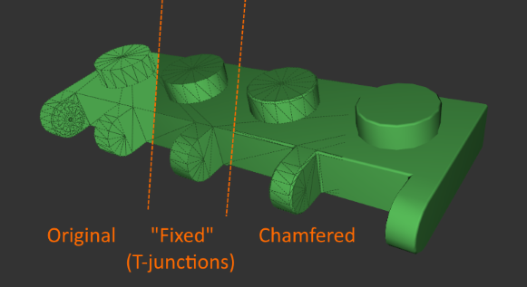
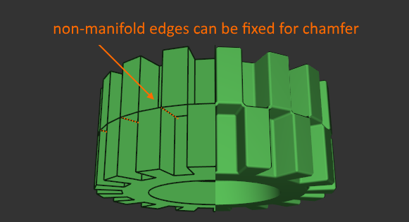

# ldrawloader

These files implement a [LDraw&trade;](http://www.ldraw.org/) (.ldr/.mpd) file loader in C/C++ and
provide some functionality to enhance the 3D mesh for rendering.

You need to have a LDraw&trade; Parts Library installed and pass the path at creation time of the loader.

# Features

> Note: API and featureset are still work in progress in this personal project.

* LdrModel and LdrPart:
  * basic ldraw part/model definitions
  * parts can be "fixed" (re-triangulate t-junctions, split edges on non-manifold joints, map edges to triangle topology etc.)
  * you can express ldraw's primitives as procedural shapes as well (e.g various flavors of `stud.dat`)
* LdrRenderModel and LdrRenderPart
  * meant for rendering, handles per-vertex normal splitting, and provides resolved per-triangle material lists if required.
  * optional chamferring for hard edges.
  * operates on "fixed parts" (implicit or explicit)
* rudimentary multi-threading support to defer loading of parts across threads





# Example

``` C++
// The C api is used here, however there is also ldr::Loader which pretty much
// works the same.

// initialize library
LdrLoaderCreateInfo  createInfo = {};
// while parts are not directly fixed, we will implicitly create a fixed version
// for renderparts
createInfo.partFixMode = LDR_PART_FIX_NONE;
createInfo.renderpartBuildMode = LDR_RENDERPART_BUILD_ONLOAD;
// required for chamfering
createInfo.partFixTjunctions = LDR_TRUE;
// optionally look for higher subdivided ldraw primitives
createInfo.partHiResPrimitives = LDR_FALSE;
// leave 0 to disable
createInfo.renderpartChamfer = 0.35f;
// installation path of the LDraw Part Library
createInfo.basePath = m_ldrawPath.c_str(); 

LdrResult result = ldrCreateLoader(&createInfo, &m_loader);
assert(result == LDR_SUCCESS);

if (singleThreaded) {
    // load a model, either in the simple (typical singleThreaded) "autoResolve" mode

    result = ldrCreateModel(m_loader, m_modelFilename.c_str(), LDR_TRUE, &m_scene.model);
    assert(result == LDR_SUCCESS || result == LDR_WARNING_PART_NOT_FOUND);

} else {
    // or by passing FALSE to autoResolve allow multi-threaded loading

    result = ldrCreateModel(m_loader, m_modelFilename.c_str(), LDR_FALSE, &m_scene.model);
    assert(result == LDR_SUCCESS || result == LDR_WARNING_PART_NOT_FOUND);

    uint32_t numParts = ldrGetNumRegisteredParts(m_loader);
    uint32_t numThreads = std::thread::hardware_concurrency();
    uint32_t perThread = (numParts + numThreads - 1) / numThreads;

    std::vector<LdrPartID> partIds(numParts);
    std::vector<LdrResult> partResults(numParts);

    std::vector<std::thread>  threads(numThreads);
    for (uint32_t i = 0; i < numThreads; i++)
    {
        threads[i] = std::thread( [&](uint32_t idx){
            uint32_t offset = idx * perThread;
            uint32_t numLocal = offset > numParts ? 0 : std::min(perThread, numParts - idx * perThread);
            if (numLocal){
            for (uint32_t p = 0; p < numLocal; p++){
                partIds[offset + p] = (LdrPartID)(offset + p);
            }
            ldrLoadDeferredParts(m_loader, numLocal, &partIds[offset], sizeof(LdrPartID), &partResults[offset]);
            }
        }, i);
    }
    for (uint32_t i = 0; i < numThreads; i++){
        threads[i].join();
    }

    // must do manual resolve after parts are loaded
    ldrResolveModel(m_loader, m_scene.model);
}

// access the model and part details directly
for (uint32_t i = 0; i < model->num_instances; i++){
    const LdrInstance& instance = model->instances[i];
    const LdrPart*     part     = ldrGetPart(m_loader, instance.part);
    const LdrRenderPart* rpart  = ldrGetRenderPart(m_loader, instance.part);
    ...
}

// the rendermodel is self-contained
result = ldrCreateRenderModel(m_loader, m_scene.model, LDR_TRUE, &m_scene.renderModel);
// so you can delete the regular model afterwards
ldrDestroyModel(m_loader, m_scene.model);

```

# Debugging / OpenGL Viewer

[ldrawloader_viewer](https://github.com/pixeljetstream/ldrawloader_viewer) is a supplementary project that is used to debug this library.

# Not a "Complete" Solution
LDraw&trade; has many features and enhancements of various complexity (animation, grouping, deformable parts etc.). Some of those
features may be added over time, however the goal of the project is mostly to provide easy-to-embed loader for basic use-cases.

Furthermore, the ldraw parts are modelled with varying complexity, and are typically not watertight, contain self-intersections and often have "floating" edges not matching the triangle or quad topology.
Therefore the chamfering or per-vertex normal computations may not always yield desired results. Hence there are some "hacks" with magic values in place to workaround some pathologies found in parts so far.
A "proper" solution would be deriving the solids through remeshing the parts completely.

# Building
The easiest is to embed the files directly, but you could also configure it
as library if needed. Furthermore a C interface exists to aid binding to
other languages. C++ 11 is required.

# Acknowledgements
* The chamfering algorithm is derived from the [Master's Thesis](https://comserv.cs.ut.ee/home/files/Algma_ComputerScience_2018.pdf?study=ATILoputoo&reference=D4FE5BC8A22718CF3A52B308AD2B2B878C78EB36) of [Diana Algma](https://github.com/dianx93)
* The vertex merging is a modified line-sweep, with sorted vertices along a single vector and was inspired by the algorithm in http://www.assimp.org/

# Other Related Projects
In case this is not what you were looking for, here are some other related projects to working with ldr files.

* Blender Importer https://github.com/TobyLobster/ImportLDraw
* three.js Loader https://threejs.org/examples/webgl_loader_ldraw.html 
* weldr ldr to glTF 2.0 converter https://github.com/djeedai/weldr
* LDD to LDR conversion, for example:
  * [description at eurobricks](https://www.eurobricks.com/forum/index.php?/forums/topic/137193-more-up-to-date-ldrawxml-lddldraw-conversion-file/)
  * [lxf2ldr](https://gitlab.com/sylvainls/lxf2ldr.html)

-----------

LDraw&trade; is a trademark owned and licensed by the Estate of James Jessiman, which does not sponsor, endorse, or authorize this project.

LEGO&reg; and the LEGO logo are registered trademarks of The Lego Group, which does not sponsor, endorse, or authorize this site. You can find the official LEGO website at http://www.lego.com.
